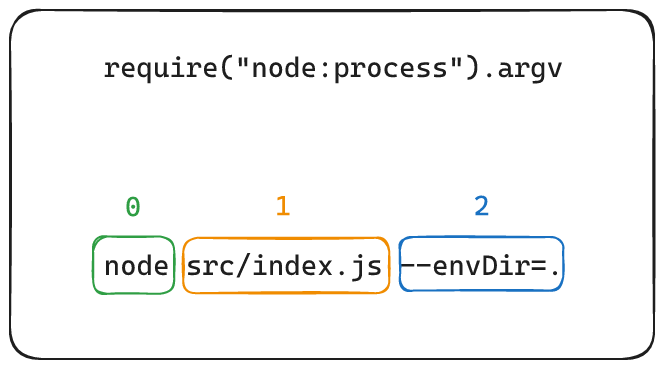

# NodeJS

## Cómo leer las variables de entorno.

En una aplicación frontend hecha con cualquier framework como React, Svelte, Angular etc, podemos leer las variables de entorno
utilizando simplemente utilizando:

```javascript
(node:process).env.ENVINROMENT_VARIABLE_NAME
```

Sin embargo, esto en ``node`` **no es posible**:

```javascript
async function Serve(request, response){
    response.writeHead(200, { 'Content-type': 'application/json;utf-8;text/plain'});
    
    // ❌ Esto no sirve
    
    const indexTemplateFile = global.nodePath.join(global.nodedProcess.env.TEMPLATE_URL, 'index.html')
    const indexTemplate = await global.nodeFsPromises.readFile(indexTemplateFile)
    response.end(indexTemplate)
}
```

Esto es porque, en el contexto de node, las variables de entorno que tiene son
las que pertenecen a **tu sistema operativo**; es decir, las variables que declaradas a nivel de la máquina, no del repositorio.

> 🌏 https://stackoverflow.com/questions/11104028/why-is-process-env-node-env-undefined

Para que node tenga acceso a esas variables de entorno definidas en el repo, necesitamos pasárselas por el parámetro por el cual le invocamos.

Tenemos que modificar el script que tengamos para levantar node y añadir la variable que deseemos rastrear: 

````json
{
  "scripts": {
    "start": "node src/index.js --envDir=."
  }
}
````

> 📝 El parámetro de la variable **siempre** debe de ir precedido por doble guión (--), porque sino ``npm`` intentará interpretarlo como un parámetro suyo y dará error.

El nombre de la variable será ``--envDir``,  y su valor `.`, que lo que nos indica es que **el directorio en el cuál se encuentra el fichero `.env` es en la raíz del proyecto**.

Para poder obtener esta variable, tenemos una función en ``nodejs`` llamada `argv`:

```javascript
const nodeProcess = require("node:process");
const arguments = nodeProcess.argv;
```

En el código de ejemplo, la variable ``arguments`` contiene **todo** lo enviado por consola. 
☝️ Cuando decimos **todo**, nos referimos a la **instrucción completa de**:

```bash
node src/index.js --envDir=.
```

Los parámetros se reciben en forma de array, y cada separación genera un item en el array, de manera que:



El argumento que queremosn ``--envDir``, se encuentra en la segunda posición, así que si hacemos:

```javascript
const nodeProcess = require("node:process");
const arguments = nodeProcess.argv;

const desiredArgument = arguments[2];
```

El resultado de ``desiredArgument`` será `.`.

